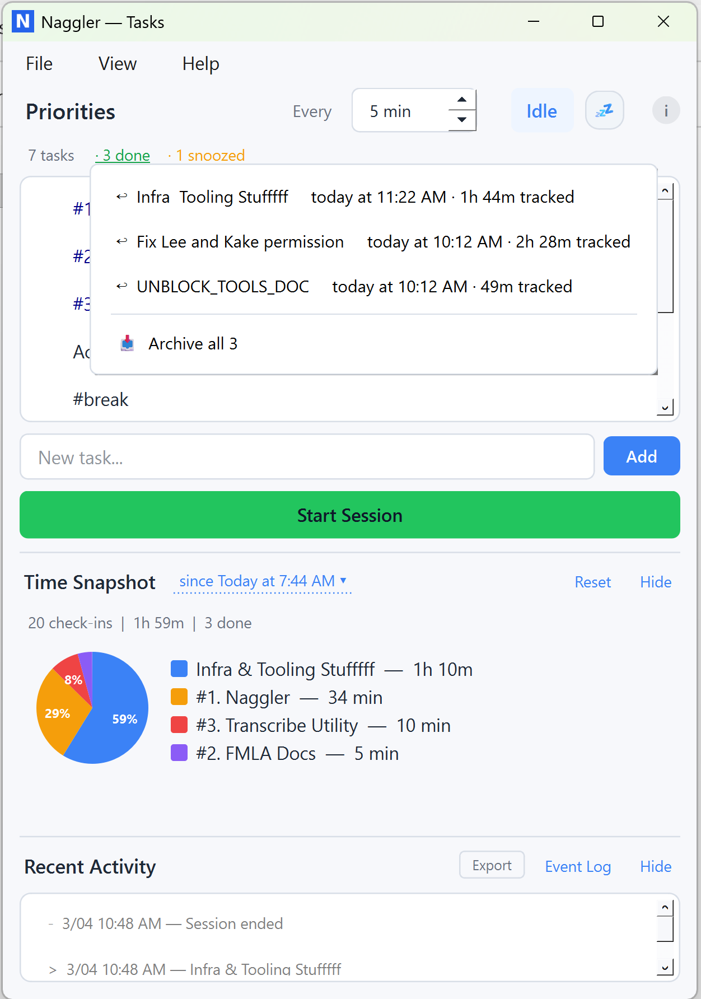
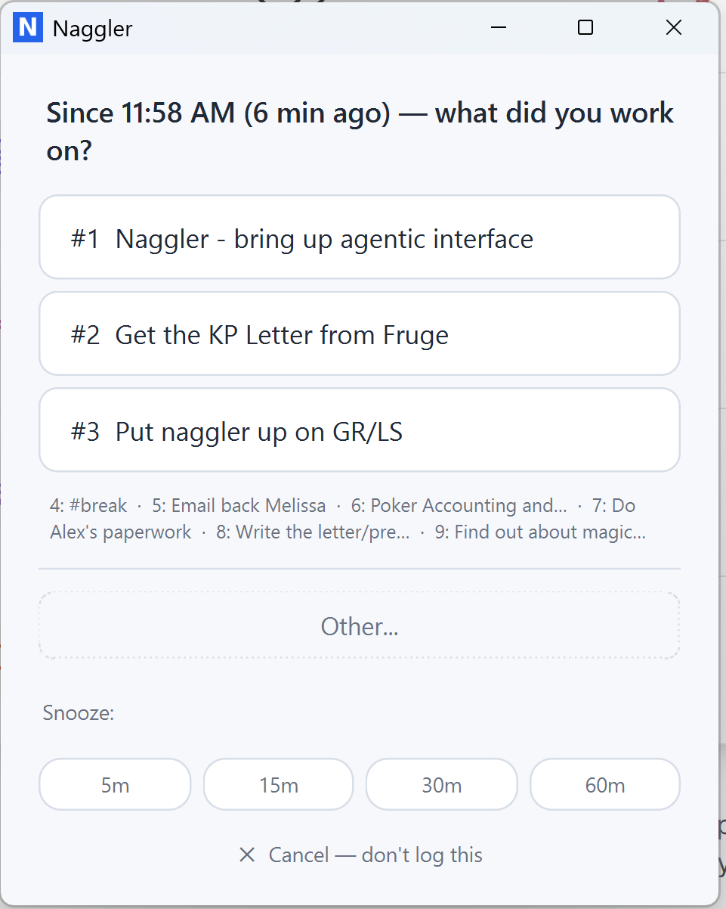
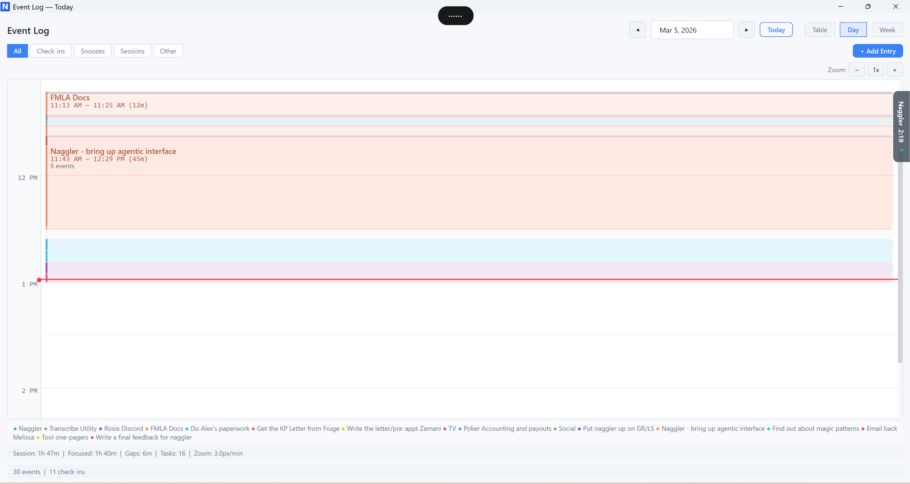

# Naggler — Attention Ledger

**Know where your focus actually goes.** One click every 5 minutes.

Naggler is a lightweight desktop app that answers a question most productivity tools ignore: *where did your attention actually go today?*

Every few minutes, a small prompt pops up with your top priorities and asks: what were you just working on? One click. Done. Under 2 seconds.

Over a day, you build an honest map of where your focus went — vs. where you said it should go. That gap is where self-awareness lives.

<p align="center">
  
  
</p>

## Download

**[Latest Release (v1.7.0)](https://github.com/MurchE/naggler/releases/latest)**

| Platform | Download | Size |
|----------|----------|------|
| Windows | [Naggler-v1.7.0-windows.zip](https://github.com/MurchE/naggler/releases/download/v1.7.0/Naggler-v1.7.0-windows.zip) | ~45 MB |
| macOS | [Naggler-v1.7.0-macOS.dmg](https://github.com/MurchE/naggler/releases/download/v1.7.0/Naggler-v1.7.0-macOS.dmg) | ~42 MB |
| Linux | [Naggler-v1.7.0-linux-x86_64.tar.gz](https://github.com/MurchE/naggler/releases/download/v1.7.0/Naggler-v1.7.0-linux-x86_64.tar.gz) | ~70 MB |

### macOS (Homebrew)

```bash
brew tap MurchE/homebrew-tap
brew install --cask naggler
```

### Windows

Download the `.zip`, extract, and run `Naggler.exe`. No installer needed.

> First launch may trigger Windows SmartScreen — click "More info" then "Run anyway." This happens because the app isn't code-signed yet.

### Linux

```bash
tar xzf Naggler-v1.7.0-linux-x86_64.tar.gz
./Naggler
```

## What It Does

- **Priority ranking** — Add 3-5 things you're working on today. Drag to reorder.
- **Periodic check-ins** — Every few minutes, a prompt asks what you just worked on. One click to log.
- **Time snapshot** — Pie chart showing where your time actually went.
- **Gap analysis** — Compares your actual time distribution against your priority ranking. Green = aligned. Amber = over-invested. Red = under-invested.
- **Auto-promote** — If you're spending more time on a lower-ranked task, Naggler suggests promoting it.
- **Day & week views** — Interactive timeline showing your focus blocks across hours and days.
- **Focus Score** — Daily score (0-100) measuring alignment between intentions and actions.
- **Export** — CSV, JSON, or styled HTML daily reports.

<p align="center">
  
</p>

## What It's NOT

- Not a to-do app. You already have one.
- Not a time tracker. Toggl already does that.
- Not a Pomodoro timer. Forest already does that.
- It's a **behavioral mirror**. Slightly uncomfortable. Never punitive. Like stepping on a scale.

## Philosophy

Every productivity tool either tracks *what you did* (passive) or *tells you what to do* (prescriptive). Nothing tracks *the delta between what you said matters and what you actually did*. That's the gap Naggler fills.

The "Other" bucket is where self-deception lives. That 35% of your day spent on things you never ranked as priorities? That's what Naggler shows you. Not to punish — to illuminate.

## Privacy

- 100% local. SQLite database stored on your machine at `~/.naggler/naggler.db`.
- **No accounts. No cloud. No telemetry. No internet required.**
- Your data never leaves your computer.

## Quick Start

See [QUICKSTART.md](QUICKSTART.md) for a complete walkthrough.

## Who It's For

- **Builders and founders** who lose hours to "just checking something real quick"
- **ADHD brains** that need gentle accountability without punishment
- **Anyone** who says "where did today go?" more than once a week

## Feedback

Found a bug or have feedback? [Open an issue](https://github.com/MurchE/naggler/issues) or email naggler@murchewings.com.

## License

Copyright 2026 Murch Ewings. All rights reserved. See [LICENSE](LICENSE).
